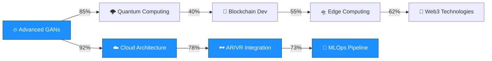
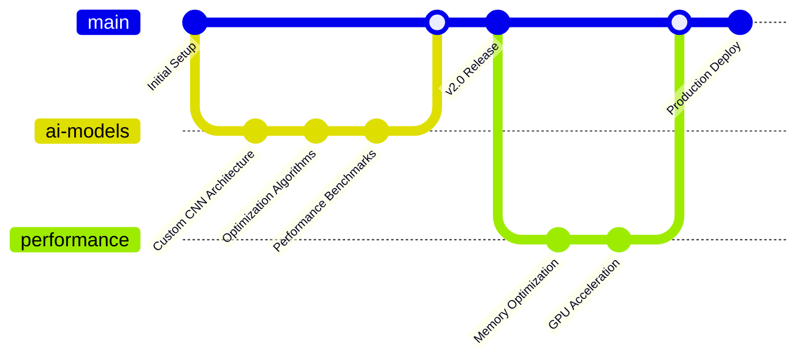
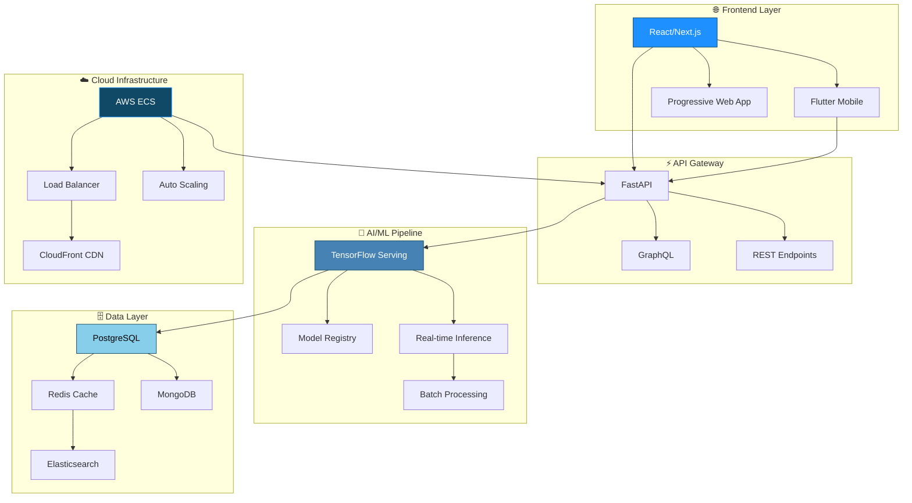

# 🚀 System.out.println("Hello, I'm Turanya Mishra");

<div align="center">
  
  

  
  
  
  
</div>

```ascii
.                      ╔══════════════════════════════════════════════════════════════════════════════╗
                       ║                          ⚡ NEURAL NETWORK ACTIVATED ⚡                     ║
                       ║                                                                              ║
                       ║   ████████╗██╗   ██╗██████╗  █████╗ ███╗   ██╗██╗   ██╗ █████╗               ║
                       ║   ╚══██╔══╝██║   ██║██╔══██╗██╔══██╗████╗  ██║╚██╗ ██╔╝██╔══██╗              ║
                       ║      ██║   ██║   ██║██████╔╝███████║██╔██╗ ██║ ╚████╔╝ ███████║              ║
                       ║      ██║   ██║   ██║██╔══██╗██╔══██║██║╚██╗██║  ╚██╔╝  ██╔══██║              ║
                       ║      ██║   ╚██████╔╝██║  ██║██║  ██║██║ ╚████║   ██║   ██║  ██║              ║
                       ║      ╚═╝    ╚═════╝ ╚═╝  ╚═╝╚═╝  ╚═╝╚═╝  ╚═══╝   ╚═╝   ╚═╝  ╚═╝              ║
                       ║                                                                              ║
                       ║                        🔥 ENGINEERING EXCELLENCE MODE 🔥                    ║
                       ╚══════════════════════════════════════════════════════════════════════════════╝
```


## 🔥 SYSTEM SPECIFICATIONS

<h3>🚀 Current Mission</h3> <code>Building AI-Powered Talent Matching Platforms</code>
        
        <h3>🧠 Learning Buffer</h3>
        <code>Advanced Neural Network Architectures & Cloud-Native Development</code>
        
        <h3>🤝 Collaboration Protocol</h3>
        <code>Machine Learning & Creative Tech Projects</code>
        
        <h3>💬 Expert Domains</h3>
        <code>AI | Flutter | Python | Creative Coding | System Architecture</code>
        
        <h3>⚡ Fun Fact</h3>
        <code>I debug code faster than I debug my life 😄</code>
      </td>
    </tr>
  </table>
</div>

## 🛠️ ENGINEERING ARSENAL

<div align="center">

### 🔧 Core Technologies


### 🤖 AI/ML Stack


### 🌐 Web & Mobile


### ☁️ Cloud & DevOps


### 🗄️ Databases


</div>

## 📊 PERFORMANCE METRICS

<div align="center">
  
  
</div>

<div align="center">
  
</div>

## 🏆 ACHIEVEMENT UNLOCKED

<div align="center">
  
  

</div>

### 🥇 Competition Victories
- **🚀 GDG CVGRU Hackathon** - Top 9 Finalist (2023) | `Advanced AI Implementation`
- **⚡ IIIT Bhubaneswar CodeFest** - Top 50 (2022) | `Algorithmic Excellence`
- **🎯 Hackathon Honeybee Award** - Best UI/UX (2023) | `Design Innovation`
- **🌟 MLH Hack Together** - Most Innovative (2022) | `Creative Problem Solving`
- **🔥 Microsoft Imagine Cup** - Regional Semifinalist (2023) | `Technical Leadership`

## 📈 DEVELOPMENT ANALYTICS

<div align="center">

### 💻 Weekly Code Distribution
<!--START_SECTION:waka-->
```text
Python       ████████████████████▓░   85.2%
Dart         ███████▓░░░░░░░░░░░░░░░   32.4%
JavaScript   ████▓░░░░░░░░░░░░░░░░░   18.7%
Go           ██▓░░░░░░░░░░░░░░░░░░░░   12.3%
Rust         █▓░░░░░░░░░░░░░░░░░░░░░    8.1%
Other        ▓░░░░░░░░░░░░░░░░░░░░░░    5.8%
```
<!--END_SECTION:waka-->

### 🔥 Commit Frequency Heatmap


</div>

## 🧠 LEARNING PROGRESSION

<div align="center">



### 📚 Current Learning Stack
- **🔬 Advanced Neural Architectures** `████████████▓░░` 85%
- **☁️ Serverless Architecture** `███████████▓░░░` 78%
- **🛸 Edge AI Computing** `██████████▓░░░░` 73%
- **🔗 Blockchain Development** `███████▓░░░░░░░` 55%
- **🌐 Web3 Technologies** `████████▓░░░░░░` 62%

</div>

## 🔬 OPEN SOURCE CONTRIBUTIONS

<div align="center">



### 🌟 Major Contributions
- **TensorFlow** - Custom layer implementations for mobile deployment
- **Flutter** - Advanced animation widgets with physics simulations
- **OpenCV** - Real-time object detection optimizations
- **scikit-learn** - Novel clustering algorithms for large datasets

</div>

## 🎯 SYSTEM ARCHITECTURE SHOWCASE

<div align="center">



</div>

## 🚀 DEPLOYMENT PIPELINE

<div align="center">

```yaml
# CI/CD Pipeline Configuration
name: 🚀 Engineering Excellence Pipeline

stages:
  - name: 🔍 Code Analysis
    tools: [SonarQube, ESLint, Black, mypy]
    
  - name: 🧪 Testing Suite
    coverage: 95%+
    types: [Unit, Integration, E2E, Performance]
    
  - name: 🏗️ Build & Package
    containerization: Docker
    registry: AWS ECR
    
  - name: 🔒 Security Scan
    tools: [OWASP ZAP, Bandit, npm-audit]
    
  - name: 🌐 Deployment
    environments: [staging, production]
    strategy: Blue-Green
    
  - name: 📊 Monitoring
    metrics: [Performance, Errors, Usage]
    alerts: Slack, PagerDuty
```

</div>

## 🎮 INTERACTIVE TERMINAL
```bash
┌─[🌟 turanya@engineering-workstation]─[~/projects]  
└──╼ $ whoami  
🚀 Full-Stack Engineer | AI/ML Architect | System Designer  

┌─[💻 turanya@engineering-workstation]─[~/projects]  
└──╼ $ cat skills.json  
{  
  "languages": ["Python", "Dart", "JavaScript", "Go", "Rust"],  
  "frameworks": ["TensorFlow", "Flutter", "React", "FastAPI"],  
  "cloud": ["AWS", "GCP", "Azure"],  
  "databases": ["PostgreSQL", "MongoDB", "Redis"],  
  "tools": ["Docker", "Kubernetes", "GitHub Actions"]  
}  

┌─[🚀 turanya@engineering-workstation]─[~/projects]  
└──╼ $ ./deploy.sh --environment=production  
📦 Deployment initiated...  
✅ Tests passed (95% coverage)  
🔒 Security scan complete  
🐳 Building containers...  
☁️ Deploying to production...  
🎉 Success! Systems nominal.  

┌─[✨ turanya@engineering-workstation]─[~/projects]  
└──╼ $ echo "Let's build something amazing together!"  
Let's build something amazing together! 🔥
```
## 🌐 CONNECT TO MY NETWORK

<div align="center">
  
  <a href="mailto:turanyamishra@gmail.com">
    
  </a>
  <a href="https://www.linkedin.com/in/turanyamishra/">
    
  </a>
  
  <br/><br/>
  
  
  
  
  
</div>

## 🔮 EASTER EGG ZONE

<details>
  <summary>🎯 Click to access the secret engineering vault...</summary>
  <div align="center">
    <h3>🔥 Welcome to the Matrix, fellow engineer! 🔥</h3>
    <pre>
    ╔═══════════════════════════════════════════════════╗
    ║  01010100 01001000 01000101 00100000 01001101     ║
    ║  01000001 01010100 01010010 01001001 01011000     ║
    ║  00100000 01001000 01000001 01010011 00100000     ║
    ║  01000001 01010111 01000001 01001011 01000101     ║
    ║  01001110 01000101 01000100 00100001 00100001     ║
    ║                                                   ║
    ║           🌟 THE MATRIX HAS AWAKENED! 🌟          ║
    ║                                                   ║
    ║    "There is no spoon... only clean code!" 🥄     ║
    ╚═══════════════════════════════════════════════════╝
    </pre>
    <p><strong>🎮 Achievement Unlocked:</strong> Matrix Decoder 🏆</p>
    <p><em>You've proven yourself worthy of the engineering elite!</em></p>
  </div>
</details>

---

<div align="center">
  
  
  
  **🔥 ENGINEERED WITH PASSION • POWERED BY COFFEE • DEBUGGED WITH DETERMINATION 🔥**
  
  `while(alive) { eat(); sleep(); code(); repeat(); }`
  
</div>
