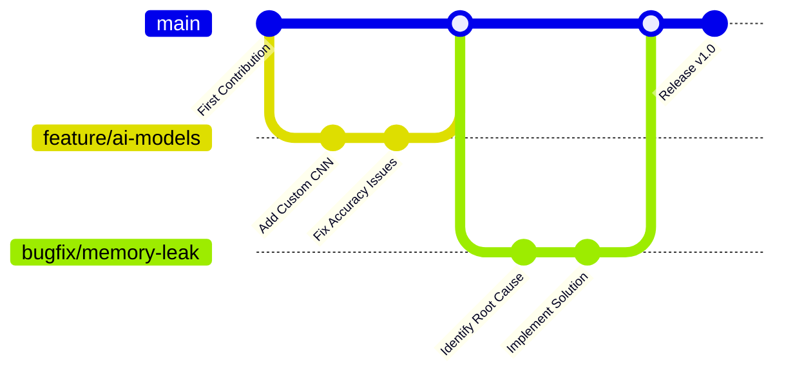

# 👋 Hi, I'm Turanya Mishra

<div align="center">
  
  

  
  
</div>


## ✨ About Me

<div align="center">
  
</div>

- 🔭 I'm currently working on **AI-Powered Talent Matching Platforms**
- 🌱 Learning **Advanced Neural Network Architectures** and **Cloud-Native Development**
- 👯 Looking to collaborate on **Machine Learning** & **Creative Tech Projects**
- 💬 Ask me about **AI, Flutter, Python, Creative Coding**
- 🌟 Fun fact: I collect digital art NFTs and contribute to open source on weekends!

<br clear="right"/>

## 🛠️ My Magical Toolkit

<div align="center">

  
  
  
  
  
  
  
  
  
  
  

  

</div>

## 🌷 Blossoming Projects

<div align="center">
  <a href="#talentbridge">
    
  </a>
  <a href="#ai-art-generator">
    
  </a>
</div>

### 🌸 TalentBridge
AI-Powered platform that matches talent with opportunities using advanced algorithms.
- **Tech Stack**: Dart | Flutter | Firebase | TensorFlow
- **Key Features**: AI Matching, Personalized Recommendations, Real-time Chat
- [View Demo](#) | [Repository](#)

### 🦋 AI-Art Generator
Create stunning artwork with neural style transfer and GANs.
- **Tech Stack**: Python | TensorFlow | PyTorch | Flask
- **Key Features**: Multiple Style Models, Custom Training, Web Interface
- [View Demo](#) | [Repository](#)

## 📊 Growth Garden

<div align="center">
  
  
</div>

<div align="center">
  
  
  
</div>

## 🏆 Prize Petals

<div align="center">
  
  
  
</div>

- 🌟 **GDG CVGRU Hackathon** - Top 9 Finalist (2023)
- 🥇 **IIIT Bhubaneswar CodeFest** - Top 50 (2022)
- 🏅 **Hackathon Honeybee Award** - Best UI/UX Implementation (2023)
- 🌈 **MLH Hack Together** - Most Innovative Project (2022)
- 🚀 **Microsoft Imagine Cup** - Regional Semifinalist (2023)

## 🛠️ Open Source Contributions



## 💫 Weekly Development Breakdown

<!--START_SECTION:waka-->
```text
Python       ██████████████▓░░░░░░  58.25%
Dart         ██████▒░░░░░░░░░░░░░░  24.38%
JavaScript   ███▒░░░░░░░░░░░░░░░░░  12.70%
HTML/CSS     ▒░░░░░░░░░░░░░░░░░░░░   3.15%
Other        ▒░░░░░░░░░░░░░░░░░░░░   1.52%
```
<!--END_SECTION:waka-->

## 🎨 Creative Showcase

<table>
  <tr>
    <td width="50%">
      <h3 align="center">AI Art Portfolio</h3>
      <p align="center">
        <a href="#" target="_blank">
          
        </a>
      </p>
      <p align="center">A collection of AI-generated artwork created using my custom style transfer algorithms</p>
    </td>
    <td width="50%">
      <h3 align="center">ML Visualization Tool</h3>
      <p align="center">
        <a href="#" target="_blank">
          
        </a>
      </p>
      <p align="center">Interactive platform to visualize complex machine learning models and data flows</p>
    </td>
  </tr>
  <tr>
    <td width="50%">
      <h3 align="center">Flutter UI Components</h3>
      <p align="center">
        <a href="#" target="_blank">
          
        </a>
      </p>
      <p align="center">Custom-designed Flutter UI components with animations and responsiveness</p>
    </td>
    <td width="50%">
      <h3 align="center">IoT Weather Station</h3>
      <p align="center">
        <a href="#" target="_blank">
          
        </a>
      </p>
      <p align="center">Smart weather monitoring system built with Raspberry Pi and custom sensors</p>
    </td>
  </tr>
</table>

## 🌱 Current Learning Journey

<div align="center">
  
  
  
</div>

- **Advanced GANs** ▓▓▓▓▓▓▓▓▓░░░░░ 65%
- **Cloud Architecture** ▓▓▓▓▓▓▓░░░░░░░ 58%
- **Quantum Computing** ▓▓▓▓░░░░░░░░░░ 40%
- **Blockchain Development** ▓▓▓▓▓▓░░░░░░░░ 50%
- **AR/VR Integration** ▓▓▓▓▓▓▓▓░░░░░ 70%

## 🌺 Let's Pollinate Ideas!

<div align="center">
  
  <a href="mailto:turanya@example.com">
    
  </a>
  <a href="https://www.linkedin.com/in/turanyamishra/">
    
  </a>
  <a href="https://twitter.com/turanyamishra">
    
  </a>
  <a href="https://dev.to/turanyamishra">
    
  </a>
  <a href="https://medium.com/@turanyamishra">
    
  </a>
  
</div>

## 🌈 GitHub Skyline

<div align="center">
  <a href="https://skyline.github.com/turanyamishra/2023">
    
  </a>
  <p>View my 3D contribution chart! ☝️ Click the image</p>
</div>

<div align="center">
  
  <!-- Ladybug Divider -->
  🐞••••••••🐞••••••••🐞••••••••🐞••••••••🐞
  
  <h3>🌟 Thanks for visiting! Let's create something amazing together! 🌟</h3>
  
  
  
</div>

<details>
  <summary>🌼 Click for a secret garden...</summary>
  <div align="center">
    <p>You've discovered my secret coding garden! Here's a special ASCII art just for you:</p>
    <pre>
           ,,.
         ,;*;;;,
        ,;*;;;;,
       ,;;*;;;;;,
      ,;;;*;;;;;;,
     ,;;;;*;;;;;;;,
    ,;;;;;*;;;;;;;;,
   ,;;;;;;*;;;;;;;;;,
  ,;;;;;;;*;;;;;;;;;;,
 ,;;;;;;;;*;;;;;;;;;;;,
 ^^^^^^^^^^^^^^^^^^^^^
    </pre>
    <p>Plant seeds of code, watch them grow!</p>
  </div>
</details>

<!-- Custom Footer -->

