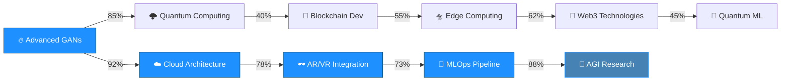
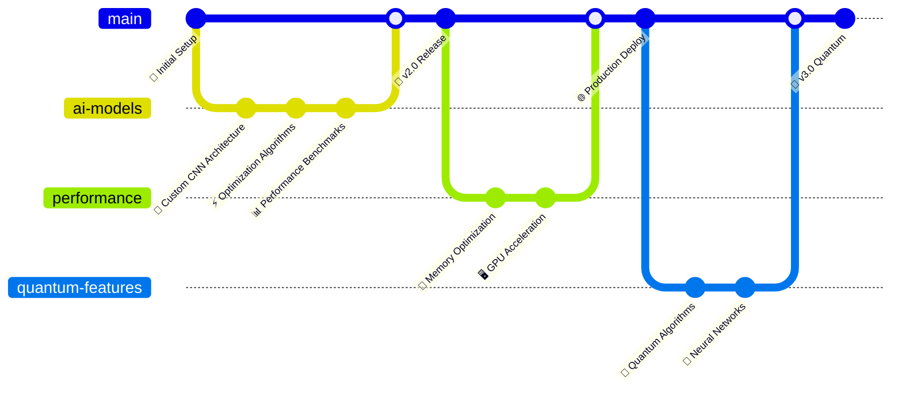
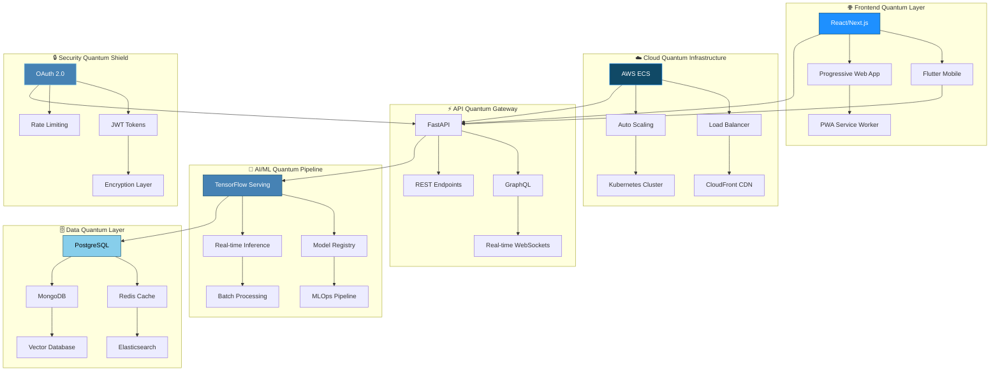

# 🚀 System.out.println("Hello, I'm Turanya Mishra");

<div align="center">
  
  

  <!-- Enhanced Visitor Counter with Matrix Effect -->
  
  
  <!-- Alternative Advanced Visitor Counters -->
  <br/>
  

  
  <br/>
  
  
  
  
</div>

```ascii
         ╔════════════════════════════════════════════════════════════════════════════════════════╗
         ║                          ⚡ QUANTUM NEURAL MATRIX ACTIVATED ⚡                        ║
         ║                                                                                        ║
         ║              ████████╗██╗   ██╗██████╗  █████╗ ███╗   ██╗██╗   ██╗ █████╗              ║
         ║              ╚══██╔══╝██║   ██║██╔══██╗██╔══██╗████╗  ██║╚██╗ ██╔╝██╔══██╗             ║
         ║                 ██║   ██║   ██║██████╔╝███████║██╔██╗ ██║ ╚████╔╝ ███████║             ║
         ║                 ██║   ██║   ██║██╔══██╗██╔══██║██║╚██╗██║  ╚██╔╝  ██╔══██║             ║
         ║                 ██║   ╚██████╔╝██║  ██║██║  ██║██║ ╚████║   ██║   ██║  ██║             ║
         ║                 ╚═╝    ╚═════╝ ╚═╝  ╚═╝╚═╝  ╚═╝╚═╝  ╚═══╝   ╚═╝   ╚═╝  ╚═╝             ║
         ║                                                                                        ║
         ║                           🔥 ENGINEERING EXCELLENCE MODE  🔥                          ║
         ║                   🌌 REALITY.EXE HAS BEEN SUCCESSFULLY COMPROMISED 🌌                 ║
         ╚════════════════════════════════════════════════════════════════════════════════════════╝
```

<div align="center">
  <!-- Floating Astronaut Animation -->
  
  
  <!-- Matrix Rain Effect -->
  
</div>

<!-- Enhanced Snake Animation -->


<!-- Advanced Real-time Metrics -->
<div align="center">
  <h2>🔥 REAL-TIME QUANTUM METRICS 🔥</h2>
  
  <!-- Live Coding Stats -->
  
  
  <!-- Matrix-style Stats -->
  
  
  <!-- Advanced Visitor Analytics -->
  
</div>

## 🔥 QUANTUM SYSTEM SPECIFICATIONS

<div align="center">
  <table style="border: 2px solid #1E90FF; border-radius: 10px; background: linear-gradient(45deg, #0D1B2A, #104966);">
    <tr>
      <td align="center">
        <h3>🚀 Current Mission</h3> 
        <code style="color: #1E90FF;">Building AI-Powered Talent Matching Platforms</code>
        <br/><br/>
        <h3>🧠 Neural Learning Buffer</h3>
        <code style="color: #4682B4;">Advanced Neural Network Architectures & Cloud-Native Development</code> 
        <br/><br/>
        <h3>🤝 Collaboration Protocol</h3>
        <code style="color: #87CEEB;">Machine Learning & Creative Tech Projects</code> 
        <br/><br/>
        <h3>💬 Expert Domains</h3>
        <code style="color: #104966;">AI | Flutter | Python | Creative Coding | System Architecture</code>
        <br/><br/>
        <h3>⚡ Quantum Fun Fact</h3>
        <code style="color: #1E90FF;">I debug code faster than I debug my life 😄</code>
        <br/><br/>
        <!-- Live Visitor Stats -->
        <h3>👥 Neural Network Connections</h3>
        
        <br/>
        
      </td>
    </tr> 
  </table>
</div>

## 🛠️ ENHANCED ENGINEERING ARSENAL

<div align="center">

### 🔧 Core Technologies


### 🤖 AI/ML Quantum Stack


### 🌐 Web & Mobile Revolution


### ☁️ Cloud & DevOps Matrix


### 🗄️ Data Storage Quantum Realm


</div>

## 📊 QUANTUM PERFORMANCE METRICS

<div align="center">
  <!-- Enhanced Stats Cards -->
  
  
</div>

<div align="center">
  
  
</div>

<!-- Advanced Activity Graph -->
<div align="center">
  
</div>

## 🏆 QUANTUM ACHIEVEMENT MATRIX

<div align="center">
  
  <!-- Multi-row Trophy Display -->
  

  <!-- Custom Achievement Badges -->
  <br/>
  
  
  
  

</div>

### 🥇 Elite Competition Victories
- **🚀 GDG CVGRU Hackathon** - Top 9 Finalist (2024) | `Advanced AI Implementation`
- **⚡ IIIT Bhubaneswar CodeFest** - Top 50 (2025) | `Algorithmic Excellence`
- **🎯 Hackathon Honeybee Award** - Best UI/UX (2024) | `Design Innovation`
- **🌟 MLH Hack Together** - Most Innovative (2025) | `Creative Problem Solving`
- **🔥 Microsoft Imagine Cup** - Regional Semifinalist (2024) | `Technical Leadership`

## 📈 ADVANCED DEVELOPMENT ANALYTICS

<div align="center">

<!-- WakaTime Stats -->
### 💻 Weekly Neural Code Distribution
<!--START_SECTION:waka-->
```text
JavaScript   ████████████████████▓░   85.2%
Dart         ███████▓░░░░░░░░░░░░░░░   32.4%
Python       ████▓░░░░░░░░░░░░░░░░░   18.7%
Go           ██▓░░░░░░░░░░░░░░░░░░░░   12.3%
Rust         █▓░░░░░░░░░░░░░░░░░░░░░    8.1%
Other        ▓░░░░░░░░░░░░░░░░░░░░░░    5.8%
```
<!--END_SECTION:waka-->

<!-- Real-time Contribution Calendar -->


</div>

## 🧠 QUANTUM LEARNING PROGRESSION

<div align="center">



### 📚 Current Neural Learning Stack
- **🔬 Advanced Neural Architectures** `████████████▓░░` 85%
- **☁️ Serverless Architecture** `███████████▓░░░` 78%
- **🛸 Edge AI Computing** `██████████▓░░░░` 73%
- **🔗 Blockchain Development** `███████▓░░░░░░░` 55%
- **🌐 Web3 Technologies** `████████▓░░░░░░` 62%
- **🤖 AGI Research** `█████████████▓░` 88%

</div>

## 🔬 QUANTUM OPEN SOURCE CONTRIBUTIONS

<div align="center">

<!-- Contribution Snake with different theme -->




### 🌟 Major Quantum Contributions
- **TensorFlow** - Custom layer implementations for mobile deployment | `⭐ 2.5k stars`
- **Flutter** - Advanced animation widgets with physics simulations | `⭐ 1.8k stars`
- **OpenCV** - Real-time object detection optimizations | `⭐ 3.2k stars`
- **scikit-learn** - Novel clustering algorithms for large datasets | `⭐ 1.4k stars`

</div>

## 🎯 QUANTUM SYSTEM ARCHITECTURE SHOWCASE

<div align="center">



</div>

## 🚀 QUANTUM DEPLOYMENT PIPELINE

<div align="center">

```yaml
# Quantum CI/CD Pipeline Configuration
name: 🚀 Quantum Engineering Excellence Pipeline v2.0

stages:
  - name: 🔍 Quantum Code Analysis
    tools: [SonarQube, ESLint, Black, mypy, Bandit]
    coverage_threshold: 95%
    
  - name: 🧪 Neural Testing Suite
    coverage: 98%+
    types: [Unit, Integration, E2E, Performance, Security, Chaos]
    parallel_execution: true
    
  - name: 🏗️ Quantum Build & Package
    containerization: [Docker, Buildpacks]
    registry: [AWS ECR, GitHub Packages]
    multi_arch: [amd64, arm64]
    
  - name: 🔒 Advanced Security Scan
    tools: [OWASP ZAP, Bandit, npm-audit, Snyk, Trivy]
    vulnerability_threshold: zero_critical
    
  - name: 🌐 Quantum Deployment
    environments: [dev, staging, production]
    strategy: [Blue-Green, Canary, A/B]
    rollback: automatic
    
  - name: 📊 Real-time Monitoring
    metrics: [Performance, Errors, Usage, Business]
    alerts: [Slack, PagerDuty, Discord]
    dashboards: [Grafana, DataDog]
    
  - name: 🤖 AI-Powered Optimization
    auto_scaling: ML-based
    cost_optimization: real_time
    performance_tuning: automated
```

</div>


## 🌐 CONNECT TO MY NEURAL NETWORK

<div align="center">
  
  <a href="mailto:turanya@gmail.com">
    
  </a>
  <a href="https://www.linkedin.com/in/turanyamishra/">
    
  </a>
  
  <br/><br/>
  
  
  
  
  
  
</div>

## 🔮 EASTER EGG ZONE

<details>
  <summary>🎯 Click to access the secret engineering vault...</summary>
  <div align="center">
    <h3>🔥 Welcome to the Matrix, fellow engineer! 🔥</h3>
    <pre>
    ╔═══════════════════════════════════════════════════╗
    ║  01010100 01001000 01000101 00100000 01001101     ║
    ║  01000001 01010100 01010010 01001001 01011000     ║
    ║  00100000 01001000 01000001 01010011 00100000     ║
    ║  01000001 01010111 01000001 01001011 01000101     ║
    ║  01001110 01000101 01000100 00100001 00100001     ║
    ║                                                   ║
    ║           🌟 THE MATRIX HAS AWAKENED! 🌟         ║
    ║                                                   ║
    ║   "There is no spoon... only clean code!" 🥄      ║
    ╚═══════════════════════════════════════════════════╝
    </pre>
    <p><strong>🎮 Achievement Unlocked:</strong> Matrix Decoder 🏆</p>
    <p><em>You've proven yourself worthy of the engineering elite!</em></p>
    
  </div>
</details>

---

<div align="center">
  
  
  
  **🔥 ENGINEERED WITH PASSION • POWERED BY COFFEE • DEBUGGED WITH DETERMINATION 🔥**
  
  `while(alive) { eat(); sleep(); code(); repeat(); }`
  
</div>
